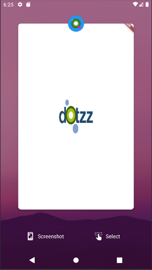

# Dotzz

Dotzz is a mobile app to support domestic abuse survivors in their journey to safety and self-empowerment.

SugarCube Security package is built by Cornell Tech Spec Team. We are aiming to provide three features, which are: 

- blur/hide the screen when the app is at background
- change icon dynamically
- build a gate and hide the software behind the gate


## Usage of Blur/hide the screen when the app is at background:



In main.dart, wrap the target screen with Overlay() and AppLifecycleOverlay():

To gain more flexibilities, I make three variable in AppLifecycleOverlay, which are imagePath, imageWidth, and imageHeight, so that we can adjust logo size from main.dart. 

```
          home: Overlay(
            initialEntries: <OverlayEntry>[
              OverlayEntry(
                builder: (BuildContext context) => AppLifecycleOverlay(
                  child: LoginScreen(),
                  imagePath: "images/logo.png",
                  imageWidth: MediaQuery.of(context).size.width * 1/3 ,
                  imageHeight: MediaQuery.of(context).size.height * 1/5,
                ),
              )
            ],
          ),
```

In android/app/src/main/AndroidManifest.xml, remove the following block
```
            <meta-data
              android:name="io.flutter.embedding.android.SplashScreenDrawable"
              android:resource="@drawable/launch_background"
              />

```


## Usage of Dynamically change the App icons feature:

Reference: 
- https://pub.dev/packages/flutter_dynamic_icon
- https://medium.com/flutter-community/programatically-change-ios-app-icon-in-flutter-c9e84bc541a2

IMPORTANT! This feature requires to use a flutter plugin that currently only supports ios.
Please refer to the documents above on how to create an App icon and setup parameters inside ios folder.

For demo purpose, 2 App icons have been pre-created to showcase the feature.

In login_screen.dart, call the function DynamicIconChangeField()

```
            Row(mainAxisAlignment: MainAxisAlignment.center, children: [
              Flexible(
                  child: ElevatedButton(
                onPressed: () =>
                    DotzzNavigator.pushNamed(context, DotzzRoutes.homeScreen),
                child: Text(localize('Login')),
              )),
            ]),
            DynamicIconChangeField(),

```

## Dotzz Gate Usage

In main.dart, and work with AppLifecycleOverlay, and long click at the + button, the gate will open (navigate to Dotzz from Todo App):
```
          home: Overlay(
            initialEntries: <OverlayEntry>[
              OverlayEntry(
                builder: (BuildContext context) => AppLifecycleOverlay(
                  child: DotzzGateHomePage(
                      child: LoginScreen()
                  ),
                  imagePath: "images/logo.png",
                  imageWidth: MediaQuery.of(context).size.width * 1/3 ,
                  imageHeight: MediaQuery.of(context).size.height * 1/5,
                ),
              )
            ],
          ),
```

And for any selected area that you want to make it a gate, and wrap the Widget with MagicContainer class, don't forget to pass in the target widget/screen to MagicContainer; for example
```
class DotzzAppBar extends StatelessWidget {
  final Widget child;

  const DotzzAppBar({Key? key, required this.child}) : super(key: key);

  @override
  Widget build(BuildContext context) {
    return MagicContainer(gate: HomeScreen(),
    child: Container(
        padding: EdgeInsets.all(16.0),
        child: Row(
          mainAxisAlignment: MainAxisAlignment.spaceBetween,
          children: [
            this.child,
          ],
        )));
  }
}

```
